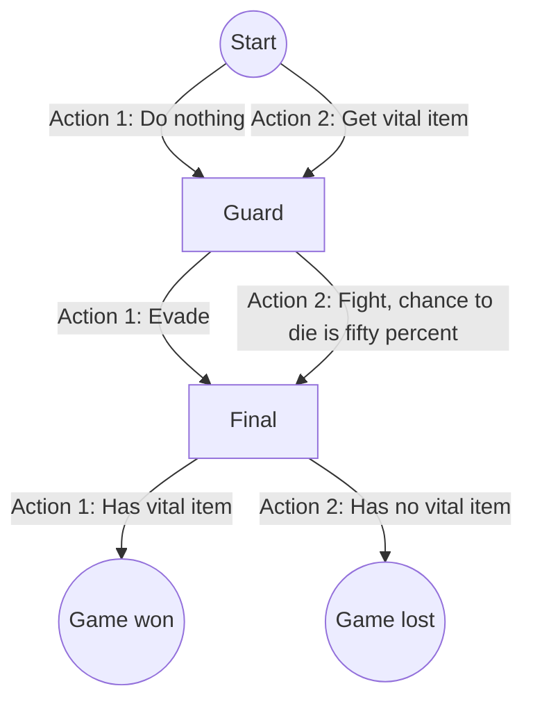

# relearn_example_1

Example of a using relearn.

 * See [mlpack_example_2](https://github.com/richelbilderbeek/mlpack_example_2)
   for the same problem using [the mlpack library](https://github.com/mlpack/mlpack)

[relearn example](https://github.com/richelbilderbeek/relearn_examples) 1: Q learning.

## Initial

State|Action 1|Action 2
-----|--------|--------
Start|1.0     |1.0
Guard|1.0     |1.0
Check|1.0     |1.0

## Final

State|Action 1|Action 2
-----|--------|--------
Start|0.0     |1.0
Guard|1.0     |0.5
Final|1.0     |0.0

